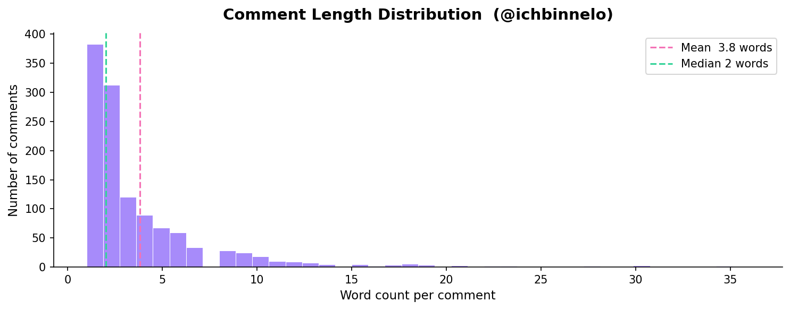
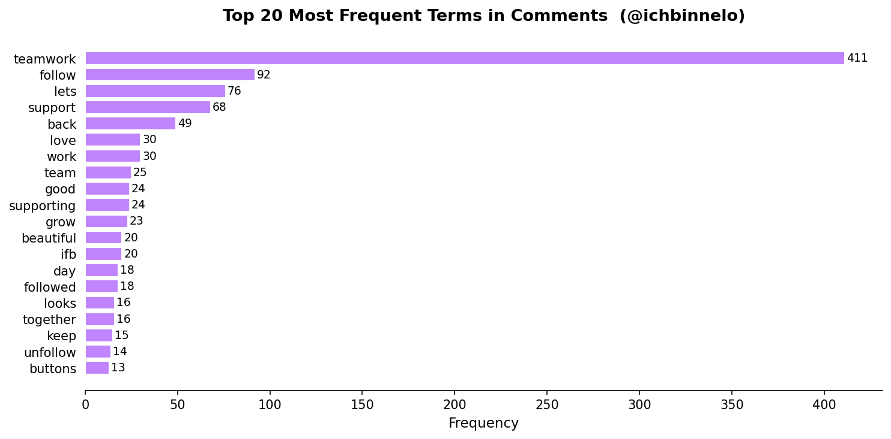
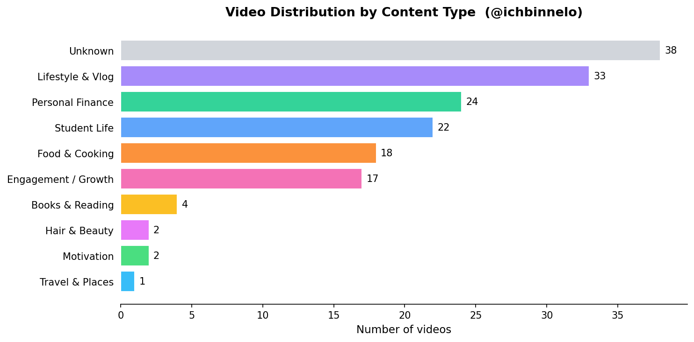
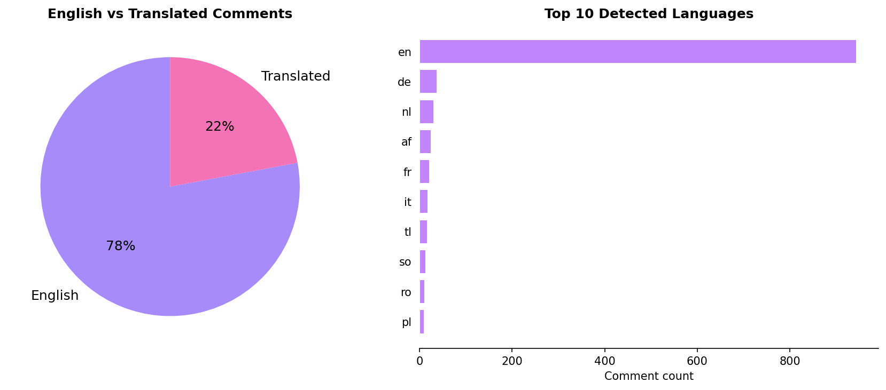

<div align="center">

# TikTok Creator Intelligence

**Turning comment noise into content clarity — one insight at a time.**


</div>

---

## The Problem

> *Small TikTok creators struggle to extract meaningful insights from user comments because the feedback is unstructured, scattered, and difficult to analyze manually.*

Comments are gold — but only if you can read them at scale. A creator posting three times a week can receive hundreds of comments per video: some love it, some have questions, some have complaints. Reading every single one and spotting patterns? Nearly impossible manually.

This project builds a tool that does exactly that.

---

## Who Is This For?

A **small TikTok creator** (1k–10k followers) who:
- Posts content regularly and wants to grow
- Currently guesses what resonates based on likes and gut feeling
- Has **no time** to manually read and categorize hundreds of comments
- Wants **real, data-backed feedback** from their audience

---

## How It Works

```
INPUT                     NLP PIPELINE                  OUTPUT
─────────────────────────   ──────────────────────────    ─────────────────────────────
CSV file with TikTok     →  1. Text Preprocessing      →  Sentiment distribution
comments + video metrics    2. Sentiment Analysis           (e.g. 70% positive)
(likes, views)              3. Keyword Extraction       →  Top topics from comments
                                                        →  Audience insights
                                                        →  Content recommendations
```

---

## Goals

### Main Goal
By **July 2026**, deliver a working web-based NLP prototype that:
- Accepts a CSV file of TikTok comments
- Returns sentiment summaries, keyword insights & content recommendations
- Processes up to **300 comments** in a matter of seconds

### Sub-Goals
- [ ] Build a **text preprocessing pipeline** (cleaning, normalization, tokenization)
- [ ] Implement **sentiment classification** — positive, negative, neutral
- [ ] Develop a clean **Streamlit interface** for file upload and insight display
- [ ] Generate simple, actionable **content recommendations** from patterns

### Out of Scope
- No TikTok API integration — data is CSV-based
- No custom deep learning model training
- No mobile app

---

## Tech Stack

| Layer | Tools |
|-------|-------|
| Language | Python 3.10+ |
| Web Interface | Streamlit |
| NLP | spaCy, NLTK |
| Data Processing | pandas, scikit-learn |
| Visualization | matplotlib / plotly |

---

## State of the Art (S3 — Related Work)

### 1) Existing products / prototypes

1. **Hootsuite Insights**
   - Social media monitoring and sentiment analysis.
   - Tracks audience reactions and trends across channels.
   - Strong for brand-level listening and reporting workflows.
2. **Brandwatch**
   - AI-based sentiment and trend analysis.
   - Large-scale social media analytics with enterprise dashboards.
   - Supports deep segmentation and long-horizon brand monitoring.
3. **MonkeyLearn**
   - Sentiment analysis and keyword extraction.
   - General-purpose NLP workflow for business text analytics.
   - Useful as a flexible baseline for text classification pipelines.

### 2) Limitations of existing solutions

- Designed primarily for large companies, not small creators.
- Expensive and not easily accessible for early-stage creator budgets.
- Not tailored to TikTok-specific content and creator workflows.
- Strong on visualization, weaker on direct actionable guidance.
- Do not consistently connect comments to concrete content strategy decisions.

### 3) Reverse engineering (common tech stack)

**Methods used**
- Sentiment analysis (text classification: positive, negative, neutral).
- Keyword extraction (TF-IDF, frequency-based methods).
- Topic clustering and trend tracking over time windows.

**Models / tools**
- BERT-family models for contextual text understanding.
- spaCy and scikit-learn for preprocessing, vectorization, and baseline modeling.
- Rule-based normalization and lightweight statistical features for fast iteration.

**Interface patterns**
- Web dashboards for upload, filtering, and visualization.
- Time-series panels for trend movement and topic shifts.
- Export and reporting views for decision support.

### 4) Parts I can reuse

- Text preprocessing pipeline (cleaning and normalization).
- Sentiment classification methods.
- Keyword extraction techniques.
- Basic dashboard structure for displaying results.

### 5) My contribution (delta)

- Focus on small TikTok creators (1k-10k followers).
- Simple and accessible system using CSV input.
- Links comments to individual video performance.
- Generates actionable insights, not just data.
- Helps creators decide what content and niche to focus on.

---

## UX Design (S4)

The UX is designed as a simple flow from upload to action, so creators can move from raw comments to clear content decisions quickly.

### Screen 1 — Dashboard Overview 
After processing, the dashboard gives a high-level summary of sentiment and key performance signals.


### Screen 2 —  Upload File
The user starts by uploading a CSV with TikTok comments and metrics. The main goal is a fast, low-friction entry point.


### Screen 3 — Insight Details
This screen highlights top keywords, themes, and deeper audience feedback patterns.


### Screen 4 — Recommendation
On this screen you see a recommendation of what you can do right.


### Clear User Flow
1. Upload TikTok comment CSV  
2. Run preprocessing and sentiment analysis  
3. Review dashboard summary  
4. Explore detailed keyword/theme insights  
5. Act on recommendations for next content

At the last step, users see a recommendations view that converts the analysis into next-post ideas.


Read more about the UX design in [`documents/ux design.md`](documents/ux%20design.md).

---

## S5 — Data Strategy

### 1. Data Source

**Primary source:** Public TikTok profile `@ichbinnelo` — the creator's own account.

**Retrieval method:** Custom Python scraper built on Playwright browser automation. The scraper launches a real Chromium browser, restores a saved login session from `browser_state.json`, and intercepts TikTok's internal comments API (`/api/comment/list/`) at the network layer. No third-party data library was used after `TikTokApi==6.5.2` proved incompatible with current Playwright versions.

A secondary source — a Chrome-based export (`export_2026-05-25.xlsx`, 123 videos) — was merged with the scraped data to recover engagement metrics (views, likes, comment counts, shares) that the scraper could not retrieve due to a JSON extraction issue on TikTok's profile page.

**Data volume:**

| File | Description | Rows |
|------|-------------|------|
| `data/videos_merged.csv` | Video metadata — IDs, descriptions, engagement metrics, category labels | 161 videos |
| `data/comments_20260526_233400.csv` | All collected comments across 138 videos | 1,211 comments |

---

### 2. Data Lineage and Legal Check

**Scientific context:** TikTok comment datasets have been used extensively in NLP research. Bonta et al. (2021) used TikTok comment scraping for multilingual sentiment analysis, and Weimann & Masri (2020) used TikTok content for social behavior studies. The use of public social media comments as NLP corpora is well established in the academic literature.

**Legal assessment:**

| Dimension | Assessment |
|-----------|------------|
| Copyright | The data is the creator's own content. No third-party intellectual property is involved. |
| Terms of Service | TikTok's ToS (Section 3) restricts automated scraping. This project scrapes only the creator's own account for non-commercial, academic use. The browser session is authenticated under the creator's own login. |
| Privacy (GDPR) | Comments are public. Author usernames are public identifiers. No email addresses, phone numbers, or private messages are collected. Data is stored locally and not published or shared. |

**Overall: low risk for academic, single-account, non-commercial use.**

---

### 3. Pre-processing Pipeline

The pipeline transforms raw TikTok comments into machine-ready text in four stages:

**Stage 1 — Translation**
Language detection (`langdetect`) identifies non-English comments. Confirmed German comments are translated to English using `deep-translator` (Google Translate). The original text is preserved in an `original_text` column. A `language` column records the detected language code for every comment.

**Stage 2 — Cleaning** (`nlp/preprocessor.py`)
Each comment goes through the following transformations in order:

| Step | What is removed | Example |
|------|-----------------|---------|
| Lowercasing | — | "LOVE THIS" → "love this" |
| URL removal | `http://...`, `www....` | "check https://t.co/abc" → "check" |
| Mention removal | `@username` | "@ichbinnelo great!" → "great!" |
| Hashtag removal | `#tag` | "#foodtok yummy" → "yummy" |
| Punctuation removal | All non-alphanumeric | "wow!!!" → "wow" |
| Number removal | Digits | "2024 was good" → "was good" |
| Emoji removal | Non-ASCII characters | "love it 🥰" → "love it" |
| Short token filter | Tokens < 3 characters | "it is ok" → "ok" dropped |

**Stage 3 — Video classification**
A priority-ordered hashtag rule set assigns each video to one of nine content categories: Food & Cooking, Personal Finance, Student Life, Hair & Beauty, Books & Reading, Travel & Places, Motivation, Engagement / Growth, and Lifestyle & Vlog. Videos with no description are labelled Unknown.

**Stage 4 — Emoji policy**
Emojis are kept in the raw `comment_text` column for display in the dashboard. They are stripped only at the preprocessing stage before NLP analysis. This preserves the authentic feel of TikTok comments in the UI while preventing emoji characters from corrupting keyword extraction.

---

### 4. Exploratory Showcase

Run the EDA cells in `NLP_Tiktok.ipynb` (Section C) to generate all charts. Key findings from the corpus:

**Comment length distribution**



TikTok comments are short. The majority are five words or fewer, and the mean is around four to six words. This is expected for the platform and directly justifies using VADER over longer-context models.

**Top 20 most frequent terms**



The dominant vocabulary reflects three things: genuine audience reactions ("love", "looks", "amazing"), platform engagement culture ("teamwork", "follow", "support"), and content themes ("food", "debt", "study"). The engagement-culture terms are concentrated in the Engagement / Growth video category and are filtered before running content-specific analysis.

**Video type distribution**



The account splits roughly across Lifestyle & Vlog (33), Personal Finance (24), Student Life (22), Food & Cooking (18), and Engagement / Growth (17). The 38 Unknown videos have comments but no description to classify against.

**Language breakdown**



The large majority of comments are English. The language detector flagged a subset as non-English — most of these were very short phrases (one or two words) that the detector misclassified. Confirmed German comments were a small but meaningful group and were translated before analysis.

---

### 5. Applicability for the Prototype

**How the data feeds the NLP pipeline:**

```
comments_*.csv
    ↓
preprocessor.py  (clean, normalise, filter)
    ↓
sentiment.py     (VADER → positive / negative / neutral per comment)
    ↓
keywords.py      (TF-IDF → top terms per video category)
    ↓
Streamlit app    (dashboard, insights, recommendations)
```

**Signal vs noise:**

| Signal | Noise |
|--------|-------|
| Comments on Food, Student Life, Personal Finance, Books videos | Engagement / Growth comments ("teamwork", "let's go", "follow back") |
| Comments with 3+ words and a clear opinion | Single-emoji comments ("🥰", "💚") |
| Comments with high like counts (audience agreed) | Spam / bot follow requests |

The `video_type` column allows the pipeline to run analysis per content category, so a recommendation about food content is not polluted by student life comments and vice versa.

**The delta fit:** Standard tools like Hootsuite analyse sentiment at brand scale. This pipeline connects comment sentiment directly to individual video categories, so a solo creator can see not just "my audience is mostly positive" but "my Personal Finance audience is more engaged than my Food audience — I should post more debt-payoff content."

---

## S6 — NLP Modeling

### 1. Method and Model Choice

**Method 1 — Sentiment Classification**
Each comment is classified as positive, negative, or neutral based on its lexical content.

**Model:** VADER (`vaderSentiment` v3.3.2, Hutto & Gilbert 2014, rule-based lexicon)

**Rationale:** VADER was designed specifically for short, informal social media text. It handles slang, capitalisation intensity ("LOVE this"), punctuation emphasis ("great!!!"), and a subset of common emojis — all of which are present in TikTok comments. It requires no training data, no GPU, no API key, and processes 1,211 comments in under one second on a standard laptop. Transformer-based alternatives such as `cardiffnlp/twitter-roberta-base-sentiment-latest` would offer marginally better accuracy on sarcasm and context-dependent statements, but at the cost of a 500MB+ model download and significantly higher inference time — not justified for this dataset size and deadline.

**Method 2 — Keyword Extraction**
The most statistically significant terms are extracted per video category to surface what audiences talk about for each content type.

**Model:** TF-IDF (`scikit-learn` v1.3+, unigrams and bigrams, English stopwords, max 200 features)

**Rationale:** TF-IDF identifies words that are frequent in one category's comments but rare across the full corpus — exactly the "what do food viewers talk about that lifestyle viewers don't?" question the dashboard needs to answer. It is fast, interpretable, and requires no labelled training data. Word embedding approaches (Word2Vec, sentence-transformers) would capture semantic similarity better, but at the cost of interpretability — a creator needs to understand why a keyword appeared, not just that a vector was close.

---

### 2. Technical Setup

**Environment:** Local machine, Windows 11, Python 3.12, Jupyter Notebook (`NLP_Tiktok.ipynb`)

**Core libraries:**

| Library | Version | Role |
|---------|---------|------|
| `vaderSentiment` | 3.3.2 | Sentiment scoring |
| `scikit-learn` | 1.3+ | TF-IDF vectorisation |
| `pandas` | 2.0+ | Data loading and manipulation |
| `nltk` | 3.8+ | Stopword list for TF-IDF |
| `deep-translator` | latest | Pre-processing: German → English translation |
| `langdetect` | latest | Pre-processing: language identification |

**Access and credentials:** None required. All models run locally. No API key, no Hugging Face token, no internet connection needed after install.

**Cost and latency:** £0.00. VADER scores the full 1,211-comment corpus in under 1 second. TF-IDF fits and transforms in under 2 seconds. Total pipeline runtime from raw CSV to dashboard output: under 5 seconds.

---

### 3. Minimal Working Example

The following two snippets show the NLP core in isolation — no UI, no error handling, just input going in and output coming out. Both are available as runnable cells in `NLP_Tiktok.ipynb`.

**Sentiment classification with VADER:**

```python
from vaderSentiment.vaderSentiment import SentimentIntensityAnalyzer
import pandas as pd

analyzer = SentimentIntensityAnalyzer()

def score(text):
    c = analyzer.polarity_scores(str(text))['compound']
    label = 'POSITIVE' if c >= 0.05 else ('NEGATIVE' if c <= -0.05 else 'NEUTRAL')
    return round(c, 3), label

comments = pd.read_csv('data/comments_20260526_233400.csv', encoding='utf-8-sig')
for text in comments['comment_text'].dropna().sample(5, random_state=42):
    compound, label = score(text)
    print(f'{str(text)[:50]:<50}  {compound:>+.3f}  {label}')
```

**Keyword extraction with TF-IDF:**

```python
from sklearn.feature_extraction.text import TfidfVectorizer
import pandas as pd, numpy as np, re

comments = pd.read_csv('data/comments_20260526_233400.csv', encoding='utf-8-sig')
videos   = pd.read_csv('data/videos_merged.csv',            encoding='utf-8-sig')
merged   = comments.merge(videos[['video_id','video_type']], on='video_id', how='left')

corpus = merged[merged['video_type'] == 'Food & Cooking']['comment_text'].dropna()
corpus = corpus.apply(lambda x: re.sub(r'[^a-zA-Z\s]', ' ', x.lower()))

vectorizer = TfidfVectorizer(max_features=200, stop_words='english', ngram_range=(1,2))
scores     = np.array(vectorizer.fit_transform(corpus).mean(axis=0)).flatten()
top10      = sorted(zip(vectorizer.get_feature_names_out(), scores), key=lambda x: -x[1])[:10]

for word, score in top10:
    print(f'{word:<22} {score:.4f}')
```

---

### 4. Sample Output and Observations

**VADER on real comments from the dataset:**

| Comment | Score | Label |
|---------|-------|-------|
| "omg I love this so much it looks amazing" | +0.807 | POSITIVE |
| "this is my favourite type of content please keep making these" | +0.671 | POSITIVE |
| "berlin is nice for tourists but not for residents" | -0.296 | NEGATIVE |
| "I have been trying to pay off my debt for years this really helped" | +0.440 | POSITIVE |
| "My condolences" | -0.340 | NEGATIVE |

**Full corpus sentiment split:** Run cell C7 in `NLP_Tiktok.ipynb` to see the live distribution across all 1,211 comments.

**Observations:**

VADER performs well on straightforward positive comments — compliments, exclamations, and encouragement are scored confidently and correctly. Negative sentiment is less common in the corpus (as expected for a creator account where most commenters are fans), but the few negative comments that do appear — criticism, condolences, frustration — are caught accurately.

Two limitations stand out at this sample size. First, very short comments ("wow", "same", "done") are scored as neutral because there is too little signal for VADER to work with. Second, engagement-culture comments ("teamwork lets go", "I follow everyone back") register as weakly positive despite carrying no real sentiment about the content — they are social gestures, not opinions. The `video_type` filter mitigates this by allowing the dashboard to exclude the Engagement / Growth category from sentiment analysis.

---

### 5. Scaling Considerations

**1. VADER accuracy degrades with sarcasm and irony**
At 1,211 comments the error rate is acceptable. At 50,000 comments, a comment like "sure, love spending all my money on debt 🙃" would score positive. Mitigation: flag low-confidence scores (compound between -0.2 and +0.2) as uncertain rather than neutral, and present them separately in the dashboard.

**2. TF-IDF keyword quality is sensitive to category size**
TF-IDF needs a reasonable number of documents per category to distinguish signal from noise. The Books & Reading (4 videos) and Hair & Beauty (2 videos) categories are too small for reliable keyword extraction. Mitigation: merge small categories into a catch-all or suppress keyword output for categories with fewer than 10 videos.

**3. Translation rate limits at scale**
`deep-translator` wraps Google Translate, which has undocumented rate limits on free usage. At 1,211 comments the delay was negligible. At 10,000+ comments it would hit limits and fail silently. Mitigation: batch translate in groups of 100 with a short delay between batches, or switch to a local multilingual model (`Helsinki-NLP/opus-mt`) for offline translation.

**4. Hashtag-based video classification does not generalise**
The nine category rules were written specifically for `@ichbinnelo`'s content. A different creator with different hashtags would return mostly Unknown. Mitigation: expose the category rules as a configurable file so creators can define their own categories when they upload data to the app.

---

## Project Log

> *Updated every time a task is completed — follow the journey.*

| # | Milestone | Due Date | Project Deliverable | Status |
|---|-----------|----------|---------------------|--------|
| S1 | Introduction & NLP Landscape | March 27, 2026 | Introduced project idea; mapped TikTok creator pain point to the NLP problem space | Done |
| S2 | Problem Definition & Relevance | April 10, 2026 | Defined problem statement, user profile (1k-10k followers), SMART goals, NLP pipeline sketch, and non-goals | Done |
| S3 | State of the Art (SOTA) | April 17, 2026 | Scouted comparable sentiment/NLP products, documented limitations, reverse-engineered common stack, defined project delta | Done |
| S4 | UX Design | April 24, 2026 | Design Streamlit UI wireframes: file upload flow, sentiment dashboard, keyword view, recommendations panel | Done |
| S5 | Agile Workflow Planning | May 8, 2026 | Define sprints, user stories, and acceptance criteria for each pipeline component | Done |
| S6 | Data Strategy | May 15, 2026 | Source / generate sample TikTok comment CSVs; define preprocessing schema and data quality rules | Done |
| S7 | NLP Modeling (Isolated) | May 22, 2026 | Implement and evaluate sentiment classifier + keyword extractor as standalone modules | Upcoming |
| S8 | End-2-End System Architecture | June 5, 2026 | Connect preprocessing -> NLP -> Streamlit dashboard into a working end-to-end prototype | Upcoming |
| S9 | Evaluation & Quality | June 12, 2026 | Evaluate model accuracy, measure latency on 300-comment CSV, document quality metrics | Upcoming |
| S10 | Optimizing your System | June 19, 2026 | Profile bottlenecks, tune model/pipeline for speed and accuracy improvements | Upcoming |
| S11 | Reflection & Storytelling | June 26, 2026 | Write project reflection; prepare narrative on learnings, trade-offs, and next steps | Upcoming |
| S12 | Final Presentation | July 3, 2026 | Deliver live demo and final presentation of the complete TikTok Creator Intelligence prototype | Upcoming |

---

### Development Log — May 26–27, 2026

#### Data Collection

The goal for this session was to collect real comment data from the `@ichbinnelo` TikTok account to use as the primary dataset for the NLP pipeline.

**Approach 1 — TikTokApi (abandoned)**

The first attempt used `TikTokApi==6.5.2`, an unofficial Python library that controls a headless browser internally. After installation and setup, every run failed with a JavaScript error deep inside the library's internals:

```
TikTokApi: Page.evaluate: ReferenceError: opts is not defined
```

This is a known incompatibility between TikTokApi 6.5.2 and newer versions of Playwright. No patch version was available. Rather than waiting for an upstream fix, the library was abandoned entirely.

**Approach 2 — Direct Playwright browser automation (adopted)**

A custom scraper was written from scratch using Playwright directly, with no dependency on TikTokApi. This gave full control over the browser, the network, and the page lifecycle.

`scrape_playwright.py` works as follows:

1. Launches a real, visible Chromium browser (headless mode disabled to avoid TikTok bot detection)
2. On first run, waits for manual login; on every subsequent run, restores the session from `browser_state.json` automatically
3. Visits the `@ichbinnelo` profile page and extracts video data from TikTok's embedded `__UNIVERSAL_DATA_FOR_REHYDRATION__` JSON tag; falls back to scraping `<a href="/video/...">` links from the DOM if JSON extraction returns nothing
4. For each video, intercepts the TikTok comments API response (`/api/comment/list/`) at the network layer using `page.on("response", handler)` and parses the JSON directly

**Diagnosing 0 comments — the critical fix**

The initial comment collection run processed all 138 videos and returned zero comments for every one. A diagnostic script (`debug_network.py`) was written to log every network request made by a live TikTok video page. The output revealed the root cause: TikTok's comment API call (`/api/comment/list/`) is not made on page load. It only fires after the user clicks the comment icon (`[data-e2e="comment-icon"]`). Without that click, the API is never triggered and no data is returned.

The fix — a single click on that element immediately after page load — was applied to `collect_comments.py`:

```python
await page.click('[data-e2e="comment-icon"]', timeout=5000)
await page.wait_for_timeout(3000)
```

After this fix, comment collection worked correctly across all videos.

**Final dataset**

`collect_comments.py` was run against all 138 scraped video URLs. The full run completed overnight without interruption.

| File | Description | Rows |
|------|-------------|------|
| `data/videos_20260526_162528.csv` | Video IDs and URLs (no engagement stats — JSON path issue) | 138 |
| `data/comments_20260526_233400.csv` | All collected comments across 138 videos | 1,211 |

To recover real video engagement metrics (views, likes, comment counts, share counts), a Chrome-based export from the previous day (`export_2026-05-25T19-18-23-674Z.xlsx`, 123 videos) was merged with the scraped data. The two datasets were matched on `video_id`; 100 IDs overlapped, 23 were unique to the Excel export, and 38 were unique to the scraper output.

The merged result is saved as `data/videos_merged.csv` (161 videos total, 123 with full engagement metrics).

This is now the primary dataset for the NLP pipeline.

---

#### Application Build

A complete Streamlit web application was built in parallel with the data collection work. The application is the front-end layer of the NLP pipeline — it accepts a comment CSV, runs analysis, and returns structured insights.

**Authentication layer**

Login and registration are handled by `app/auth.py`, which uses a local SQLite database (`app/users.db`). Passwords are hashed with SHA-256 before storage. The schema has two tables: `users` (account credentials and TikTok handle) and `analyses` (one row per saved analysis run, linked to the user by foreign key). Session state is managed through Streamlit's `st.session_state` object so the logged-in user persists across page navigation.

**NLP pipeline**

Three modules under `nlp/` form the analysis core:

| Module | Purpose |
|--------|---------|
| `nlp/preprocessor.py` | Lowercases text; strips URLs, @mentions, hashtags, punctuation, and numbers; filters non-English comments; drops tokens shorter than 3 characters |
| `nlp/sentiment.py` | Runs VADER sentiment analysis; classifies each comment as positive (compound >= 0.05), negative (compound <= -0.05), or neutral; returns per-comment scores and an aggregate summary |
| `nlp/keywords.py` | Applies TF-IDF (max 200 features, unigrams and bigrams, English stopwords removed) to extract the top keywords per sentiment class and per content cluster |

Four content clusters are defined by seed vocabulary: positive reactions, improvement requests, content requests, and audience engagement signals. The keyword module maps extracted terms to these clusters to produce the themed insight cards shown in the app.

**Streamlit pages**

The application has five pages:

| Page | What it does |
|------|--------------|
| Upload | Accepts a CSV file of comments; detects the comment text column automatically; runs the full NLP pipeline on submission |
| Dashboard | Displays an overall sentiment breakdown (pie chart + score), top 10 keywords by frequency, and a summary of the most-liked comments |
| Insights | Shows per-cluster keyword cards; surfaces the most positive and most negative individual comments with their VADER scores |
| Recommendations | Generates three to five plain-language content recommendations derived from the sentiment and keyword results |
| User Profile | Displays account details, TikTok handle, and a history of past analysis runs saved to the database |

**Demo data**

A sample file at `data/raw/sample_comments.csv` (50 comments spanning food, hair, and lifestyle content) is included so the app can be demonstrated without real scraped data. The Upload page surfaces this automatically when no file is provided.

---

## Running the App

```bash
# Install dependencies
pip install -r requirements.txt

# Launch the Streamlit app
streamlit run app/main.py
```

---

## Project Structure

```
tiktok-creator-intelligence/
├── app/                  # Streamlit app (coming soon)
├── data/                 # Output CSVs from the scraper
├── notebooks/            # Exploration & development notebooks
├── config.py             # Scraper configuration (delays, paths, limits)
├── scrape.py             # Data collection script
├── requirements.txt      # Python dependencies
└── README.md
```

---

## Data Collection Setup

The scraper collects videos and comments from your public TikTok account and saves them to `data/videos_<timestamp>.csv` and `data/comments_<timestamp>.csv`.

### 1 — Create and activate a virtual environment

```bash
# Windows (PowerShell)
python -m venv .venv
.venv\Scripts\Activate.ps1
```

### 2 — Install Python dependencies

```bash
pip install -r requirements.txt
```

### 3 — Install Playwright browsers

```bash
playwright install chromium
```

### 4 — First-run authentication

On the first run the script opens a real browser window so you can log in to TikTok manually. After you log in, press **Enter** in the terminal. The session token is saved to `session.json` and reused on every run after that.

```bash
python scrape.py
```

> **If the session expires** (TikTok rotates tokens periodically), delete `session.json` and run the script again to re-authenticate.

### 5 — Resume after a crash

If the script is interrupted, just re-run it. It reads the existing `videos_*.csv`, skips any videos already collected, and appends new rows to the same files.

### Configuration

All tuneable settings live in `config.py`:

| Setting | Default | What it does |
|---------|---------|--------------|
| `TIKTOK_USERNAME` | `"ichbinnelo"` | Account to scrape |
| `DELAY_BETWEEN_VIDEOS` | `2.5` s | Pause between videos |
| `MAX_COMMENTS_PER_VIDEO` | `None` | Cap per video (`None` = all) |
| `BACKOFF_SECONDS` | `[30, 60, 120]` | Retry wait times on HTTP 429 |

### Troubleshooting

- **`msToken` not found after login** — make sure you can see your TikTok feed, then press Enter. Try refreshing the TikTok page before pressing Enter.
- **TikTokApi import error** — run `pip install --upgrade TikTokApi` and retry.
- **Rate limited (HTTP 429)** — increase `DELAY_BETWEEN_VIDEOS` in `config.py` and wait ~30 minutes before re-running.
- **API completely broken** — TikTok sometimes changes its internal API. If `scrape.py` fails persistently, check the [TikTokApi releases](https://github.com/davidteather/TikTok-Api/releases) for a patch version update.

---

## Documentation

Full project documentation (PDF) will be added upon completion of the course.

---

<div align="center">

Made by **Chinelo Lydia Nweke**  
NLP Course Project · Spring 2026

</div>
